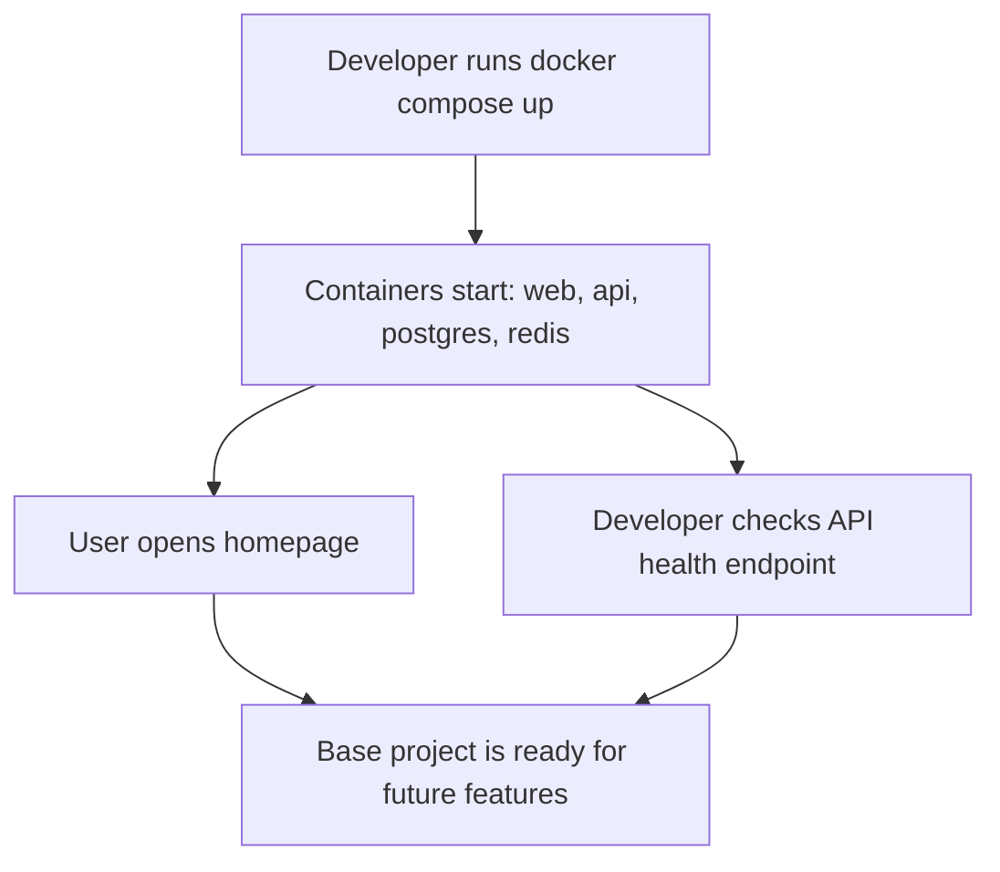

## 1. Product Overview
Recruitment App - UK Cloud is a starter recruitment platform with a Next.js frontend and a Fastify backend.
- It provides a simple homepage, a health-check API, and local infrastructure with PostgreSQL and Redis for future feature growth.
- It targets local development first so the project can become a stable base for later signup, profiles, CV parsing, and recruiter workflows.

## 2. Core Features

### 2.1 Feature Module
1. **Home page**: simple landing page with project title and starter messaging
2. **API health endpoint**: backend route for container and service health checks
3. **Local development stack**: Docker-based orchestration for web, API, PostgreSQL, and Redis
4. **Developer onboarding**: README with local run steps

### 2.2 Page Details
| Page Name | Module Name | Feature description |
|-----------|-------------|---------------------|
| Home page | Hero section | Displays the text "Recruitment App - UK Cloud" |
| Home page | Layout shell | Minimal structure ready for future navigation and sections |

## 3. Core Process
The developer starts all services with Docker Compose, opens the web app in the browser, and verifies backend readiness through the `/health` endpoint.

## 4. User Interface Design
### 4.1 Design Style
- Primary color: deep slate
- Secondary color: cloud blue
- Accent color: soft cyan
- Button style: simple rounded buttons for future reuse
- Font and sizes: clean system sans-serif for this starter phase
- Layout style: desktop-first centered landing layout
- Icon style suggestions: minimal line icons if added later

### 4.2 Page Design Overview
| Page Name | Module Name | UI Elements |
|-----------|-------------|-------------|
| Home page | Hero section | Large headline, small supporting copy, clean spacing, subtle background tint |
| Home page | Layout shell | Max-width container, centered content, responsive padding |

### 4.3 Responsiveness
Desktop-first layout with mobile-adaptive spacing and typography scaling for smaller screens.
