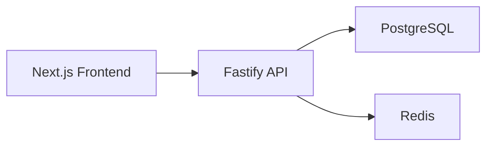
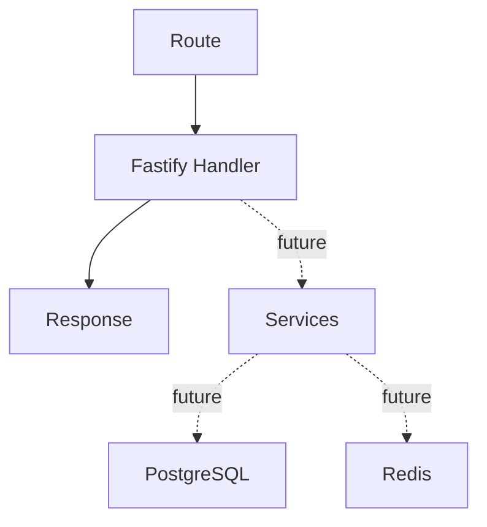
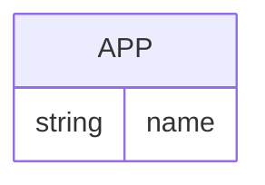

## 1. Architecture Design


## 2. Technology Description
- Frontend: Next.js (App Router) + React + TypeScript
- Backend: Node.js + Fastify
- Database: PostgreSQL
- Cache / queue-ready service: Redis
- Container orchestration: Docker Compose

## 3. Route Definitions
| Route | Purpose |
|-------|---------|
| / | Frontend homepage with starter branding |
| /health | Backend health endpoint returning `OK` |

## 4. API Definitions
```ts
type HealthResponse = "OK";
```

### GET /health
- Response: plain text `OK`

## 5. Server Architecture Diagram


## 6. Data Model
### 6.1 Data Model Definition


### 6.2 Data Definition Language
This base setup does not require application tables yet. PostgreSQL and Redis are provisioned now so later features can add schema migrations and caching without changing the local infrastructure model.
